# How to Install Raspberry Pi OS on an SD Card

## Materials Needed:
- Raspberry Pi 4 (minimum 4GB RAM, 8GB recommended)
- MicroSD Card ([Samsung PRO Endurance](https://www.samsung.com/us/computing/memory-storage/memory-cards/pro-endurance-adapter-microsdxc-64gb-mb-mj64ka-am/), 64GB recommended)
- MicroSD Card reader

## Instructions:

### 1. Download Raspberry Pi Imager
- Visit the [Raspberry Pi Imager download page](https://www.raspberrypi.com/software/).
- Download and install the software for your operating system (Windows, macOS, or Linux).
  :::{note}
  These instructions are for Raspberry Pi Imager version 2.0 or later.
  :::

### 2. Prepare the SD Card
- Insert your MicroSD card into the card reader and connect it to your computer.

### 3. Launch Raspberry Pi Imager
- Open the Raspberry Pi Imager application. Imager walks you through each set-up step in order: **Device**, **OS**, **Storage**, **Customisation**, **Writing**, and **Done**.

### 4. Select the Device
- Select **Raspberry Pi 4**, then click **NEXT**.
  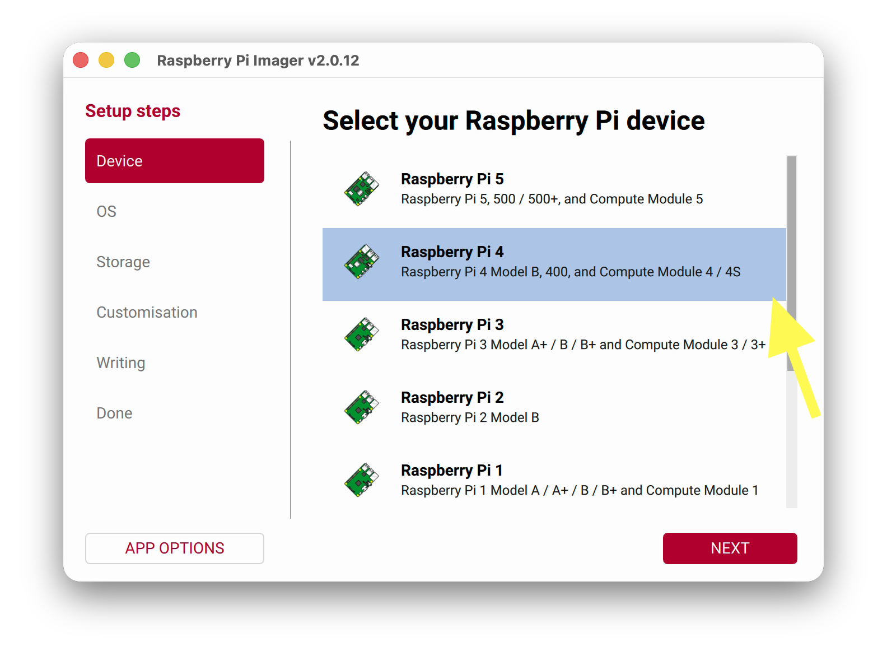

### 5. Select the OS
- Select **Raspberry Pi OS (64-bit)**, then click **NEXT**.
  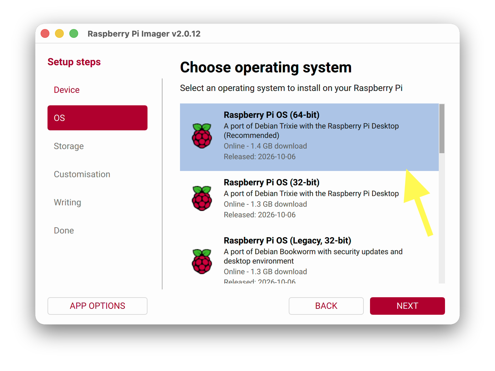

### 6. Select the Storage
- Select your MicroSD card from the list, then click **NEXT**.
  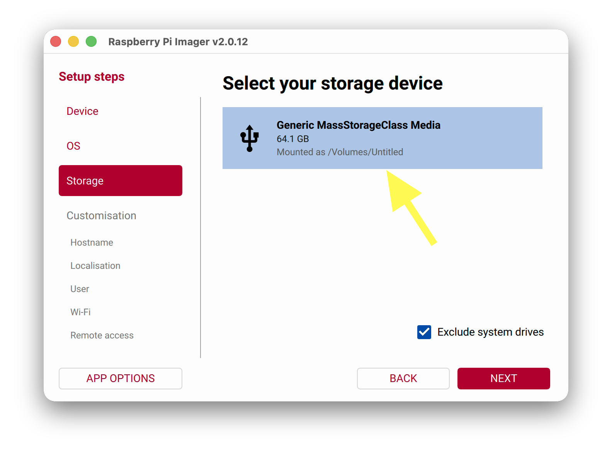
  :::{note}
  Leave "Exclude system drives" checked, so you can't accidentally erase your computer's own drive.
  :::

### 7. Customise the OS
Imager now walks you through the customisation settings, one screen at a time. Click **NEXT** after each one.

### 7a. Hostname
- Set the hostname to **valet-vision**, **valet-link**, (or some other preferred name).
  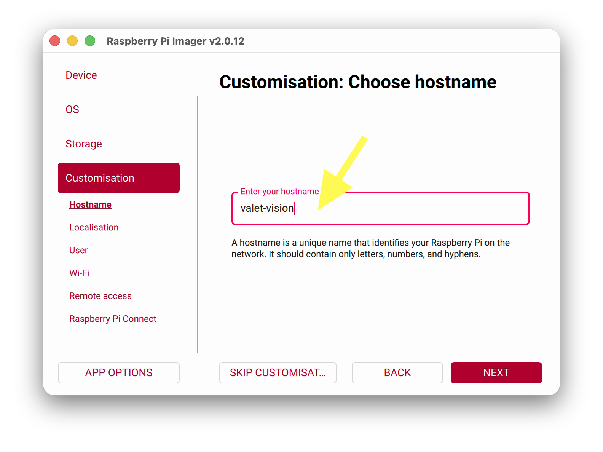
  :::{note}
  If you will have more than one Valet on your network, we recommend adding a number after the hostname (e.g. "valet-vision-34").
  :::

### 7b. Localisation
- *(Optional)* Set your time zone and keyboard layout.
  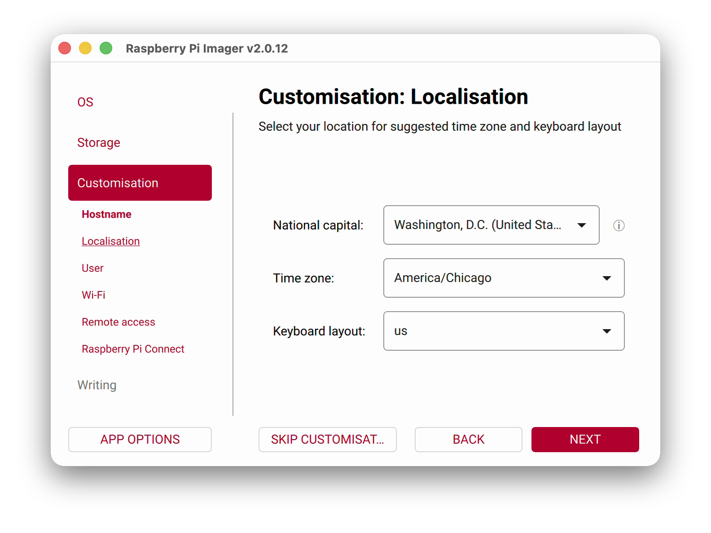

### 7c. User
- Set the username to **tapster**.
- Enter a password, then enter it again to confirm it. Store it somewhere safe, like a password manager.
  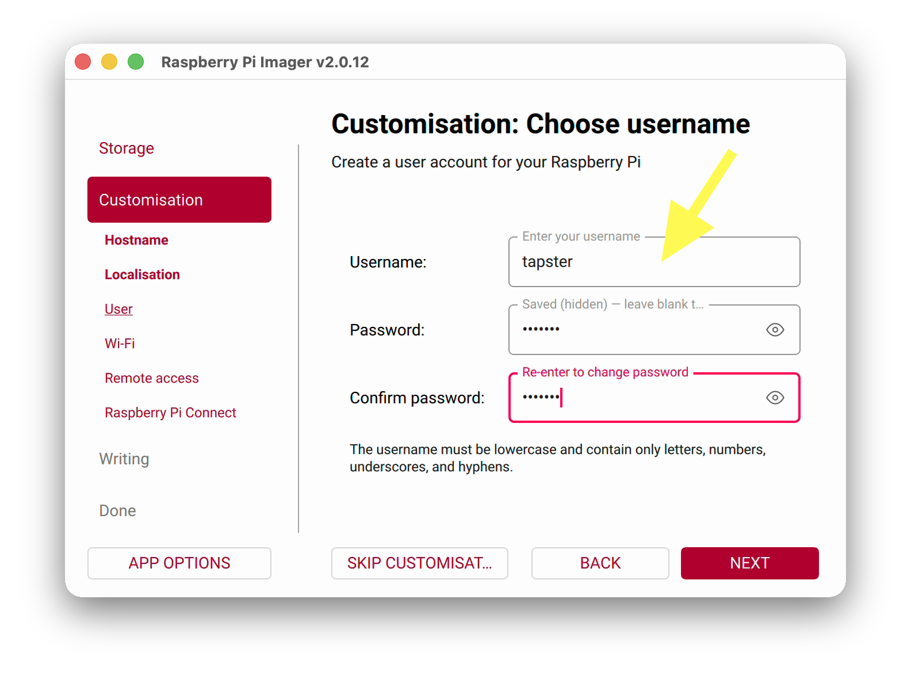

### 7d. Wi-Fi
- If you'll be using a *wireless* network connection with your Valet, enter the SSID (network name) and Wi-Fi password. However, if you'll be using a *wired* network connection, then leave the Wi-Fi fields blank.
  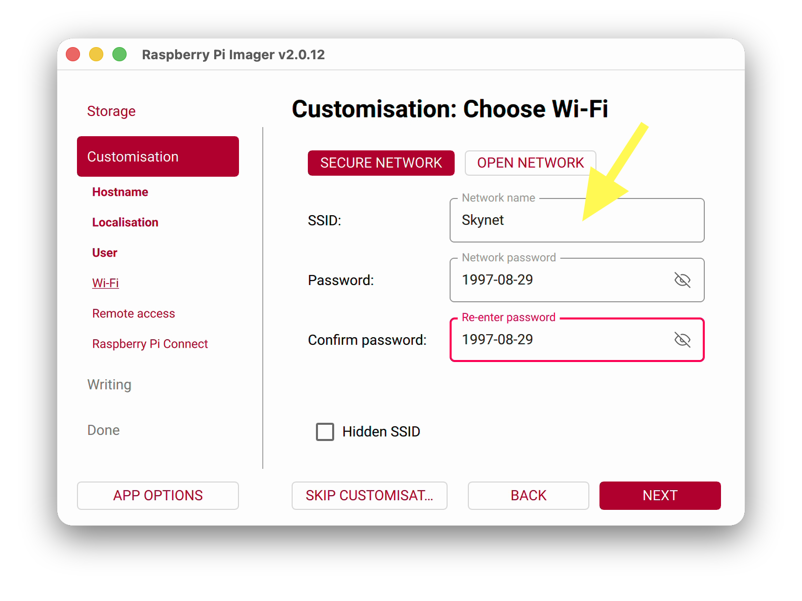
  :::{note}
  On macOS, Imager may offer to fill in the Wi-Fi password from your system keychain. Click **NO** unless you want Valet to join the same Wi-Fi network as your computer.
  :::
  :::{note}
  In the default installation, we do not set Wi-Fi credentials here with Raspberry Pi Imager; instead, we use _[Comitup](https://davesteele.github.io/comitup/)_ to bootstrap Wi-Fi support. However, the use of Comitup is configurable, and can be disabled when the system set-up scripts are run in a later step. If you really would rather set up Wi-Fi here, though, go for it!
  :::

### 7e. Remote Access
- Turn on **Enable SSH** and select **Use password authentication**.
  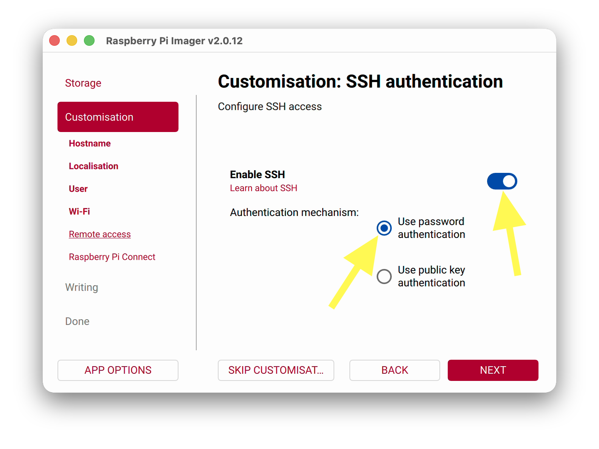
  :::{note}
  You can also enable key-based authentication later after logging into Valet.
  :::

### 7f. Raspberry Pi Connect
- Leave **Enable Raspberry Pi Connect** turned off.
  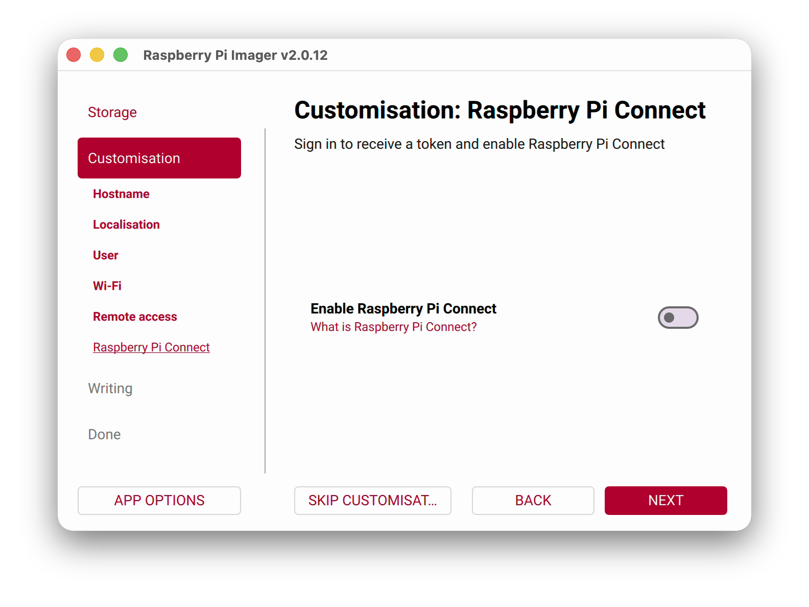

### 8. Write the OS to the SD Card
- Review the summary of your choices, then click **WRITE**.
  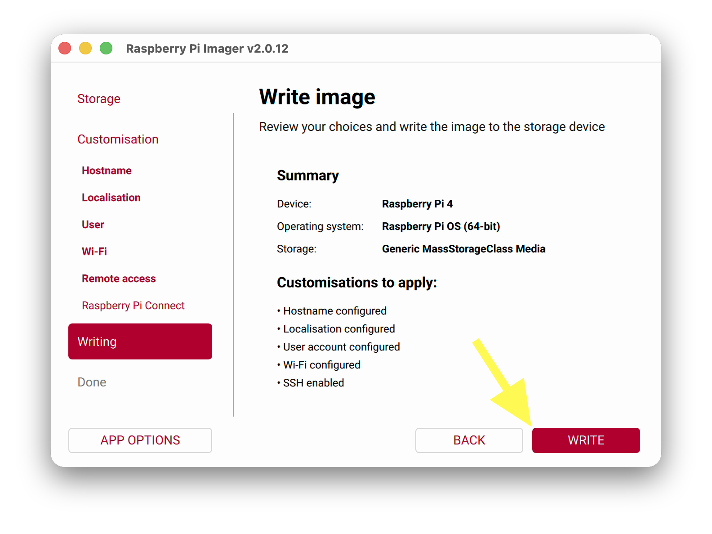
- When warned that all data on the SD card will be erased, click **I UNDERSTAND, ERASE AND WRITE**.
  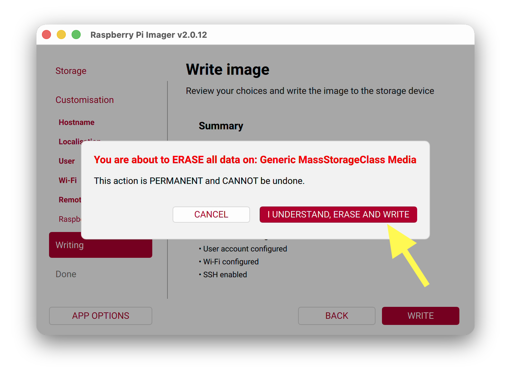
- If you're shown an admin prompt, grant the Imager permission to continue.
  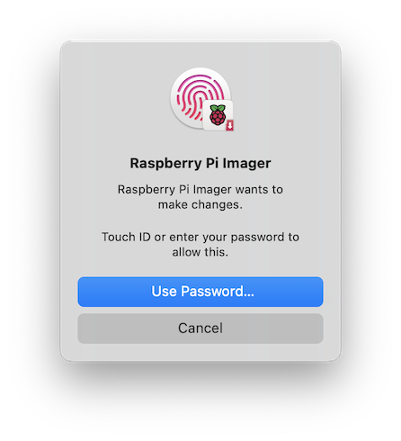
- Wait for the writing and verifying process to complete; this may take a few minutes.
  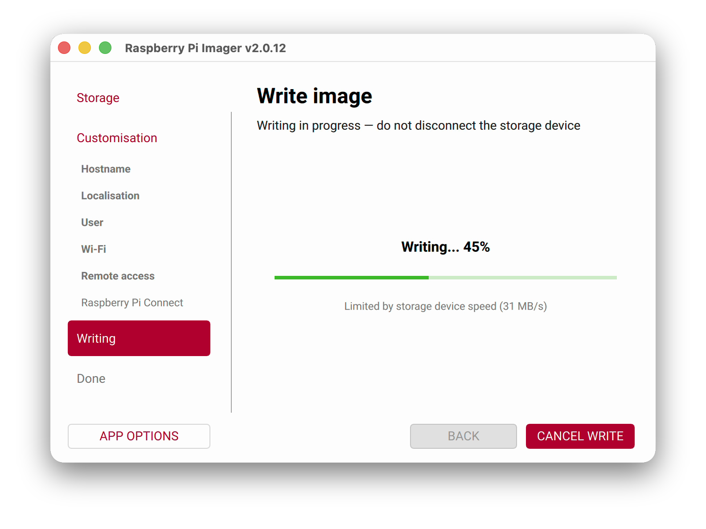

### 9. Remove the SD Card
- When the write is complete, Imager ejects the SD card automatically. Click **FINISH** and remove the SD card from your computer.
  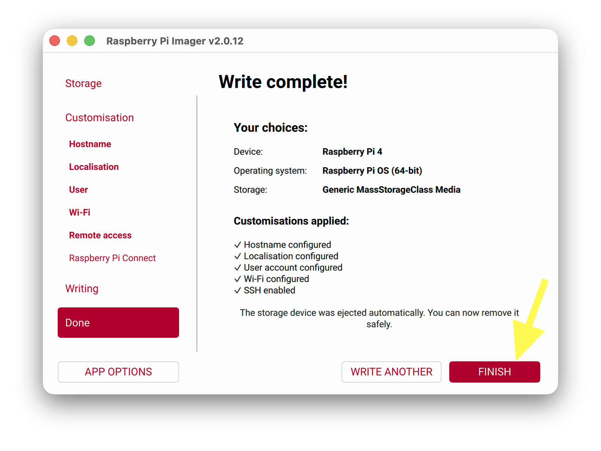

### 10. Boot Up Your Valet
- Insert the MicroSD card into the Valet's Raspberry Pi.
- (Optional) If no wireless connection was configured, connect a wired network cable to the Valet.
- Connect the Valet to a power supply.

### 🎉 Well done!
Well, almost! Your Valet's Raspberry Pi is now running Raspberry Pi OS, but next we need to install Valet specific software.
