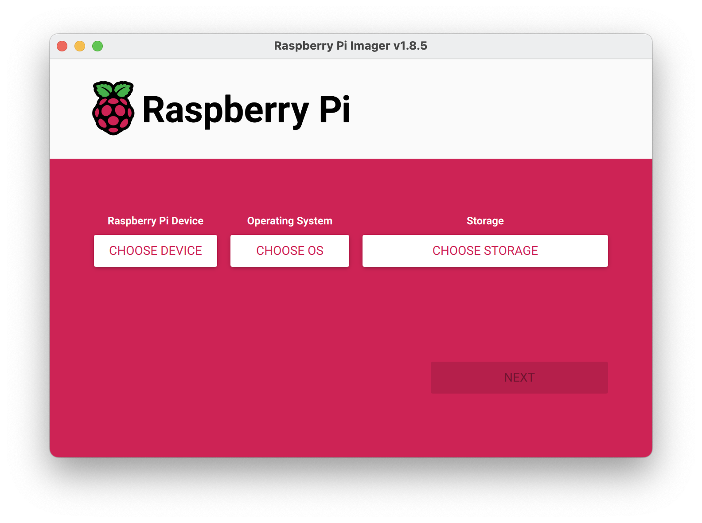
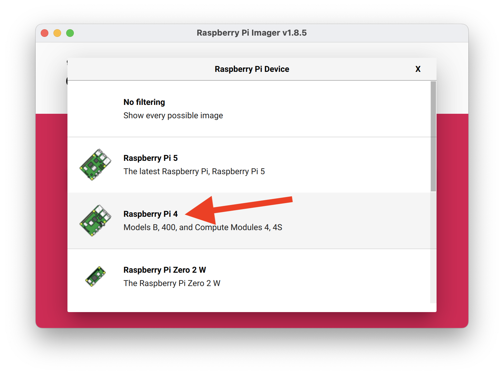
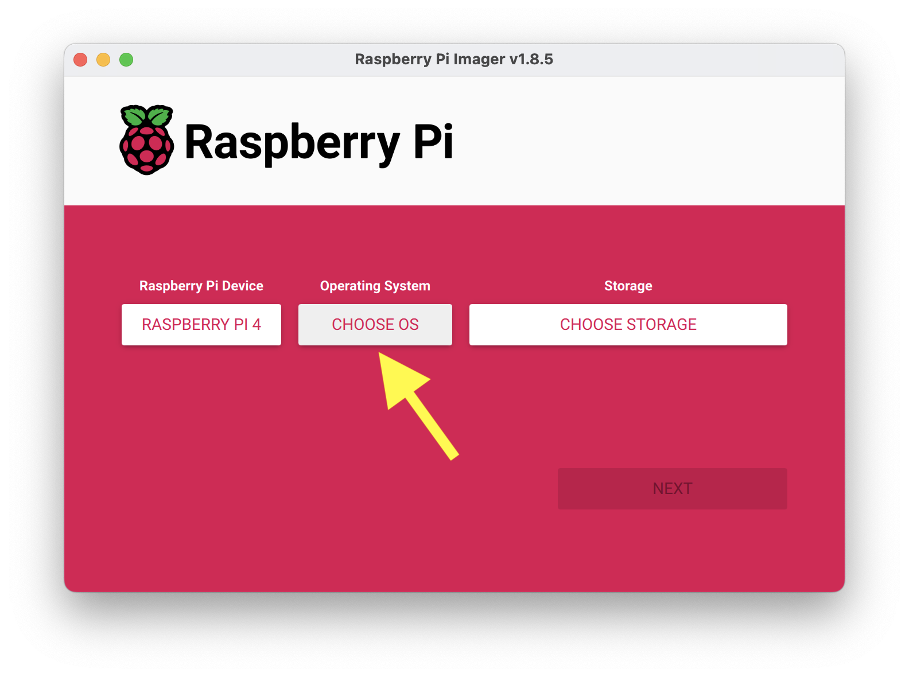
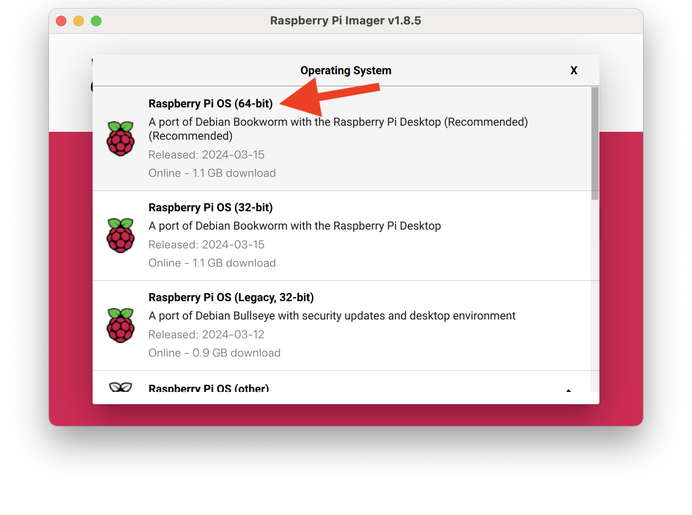
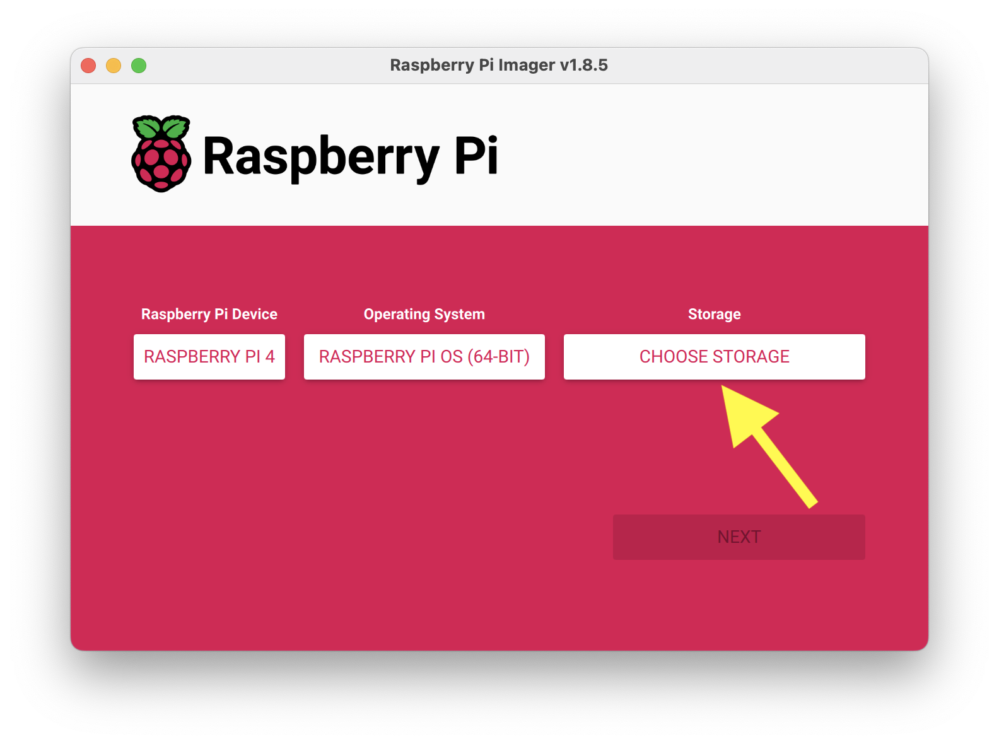
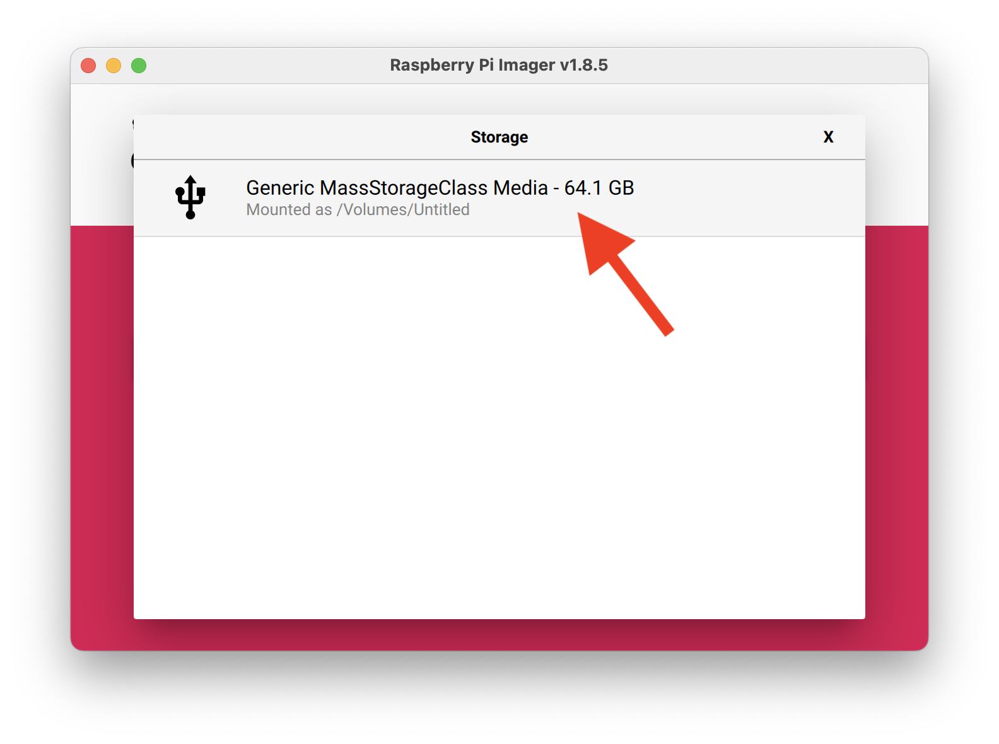
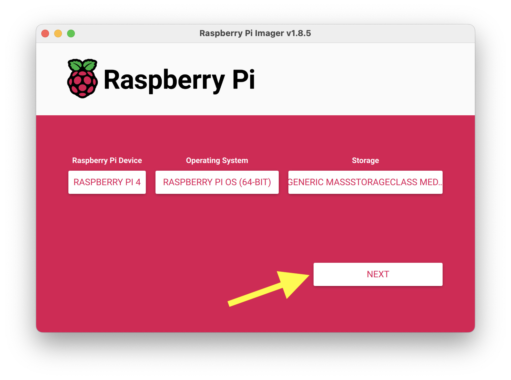
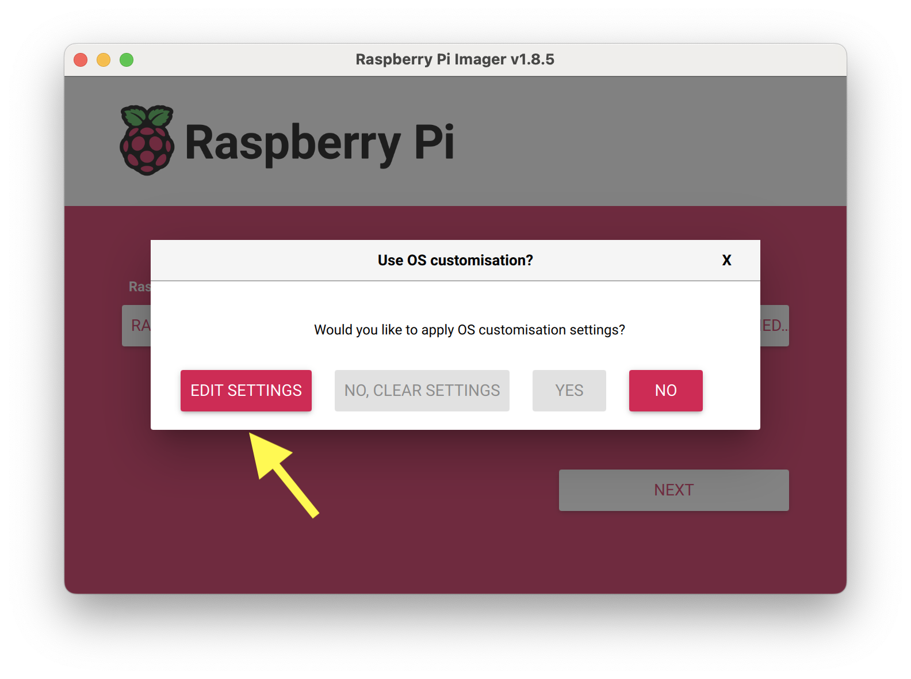
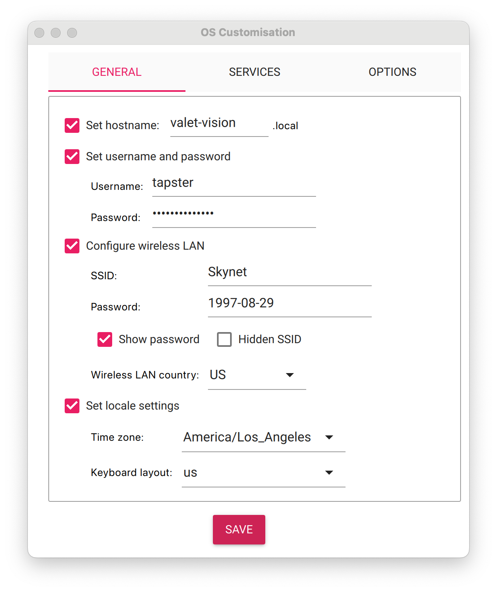
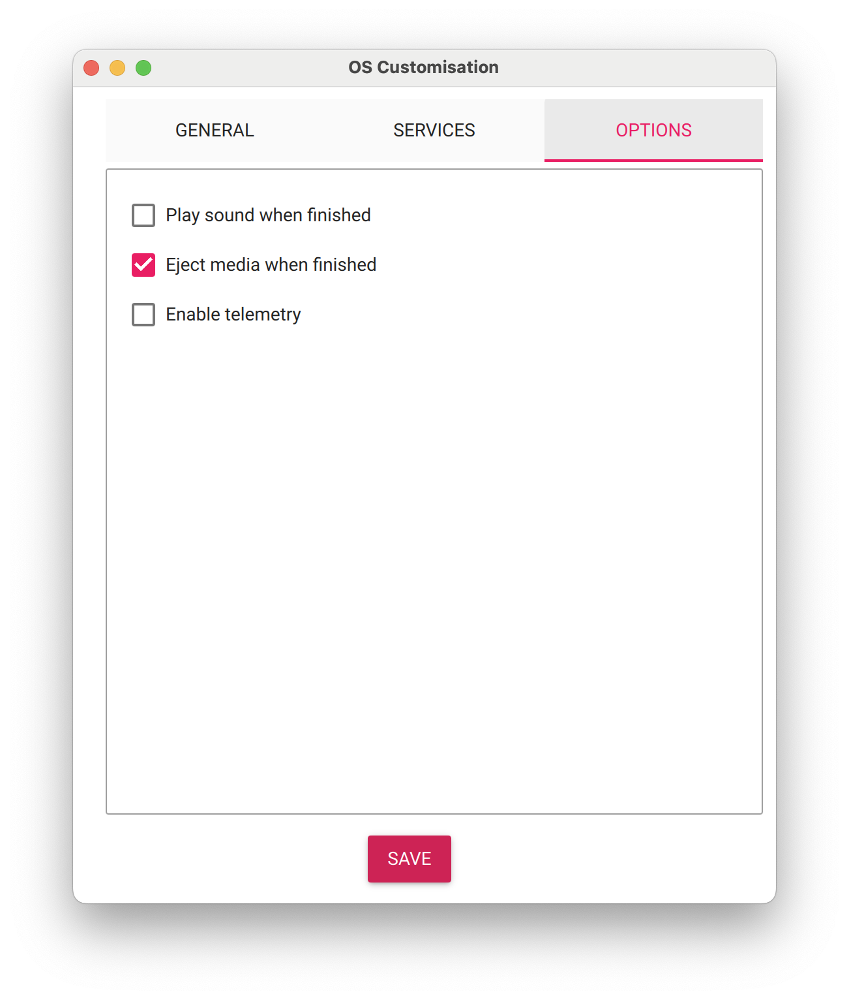

# How to Install Raspberry Pi OS on an SD Card

## Materials Needed:
- Raspberry Pi 4 (minimum 4GB RAM, 8GB recommended)
- MicroSD Card ([Samsung PRO Endurance](https://www.samsung.com/us/computing/memory-storage/memory-cards/pro-endurance-adapter-microsdxc-64gb-mb-mj64ka-am/), 64GB recommended)
- MicroSD Card reader

## Instructions:

### 1. Download Raspberry Pi Imager
- Visit the [Raspberry Pi Imager download page](https://www.raspberrypi.com/software/).
- Download and install the software for your operating system (Windows, macOS, or Linux).

### 2. Prepare the SD Card
- Insert your MicroSD card into the card reader and connect it to your computer.

### 3. Launch Raspberry Pi Imager
- Open the Raspberry Pi Imager application.
  

### 4. Select the Device
- Click on **CHOOSE DEVICE**.
  
- Select **Raspberry Pi 4**.
  

### 5. Select the OS
- Click on **CHOOSE OS**.
  
- Select **Raspberry Pi OS (64-bit)**.
  

### 6. Select the Storage
- Click on **CHOOSE STORAGE**.
  
- Select your MicroSD card from the list.
  

### 7. Edit Settings
- Click on **NEXT**.
  
- Click on **EDIT SETTINGS**.
  

### 7a. General Settings
- Select the **GENERAL** tab and make the following changes:
  - Set hostname to **valet-vision**, **valet-link**, (or some other preferred name).
    :::{note}
    If you will have more than one Valet on your network, we recommened adding a number after the hostname (e.g. "valet-vision-34").
    :::
  - Set the username to **tapster**.
  - Enter a password and store it somewhere safe, like a password manager.
  - If you'll be using a *wireless* network connection with your Valet, enter SSID and Wi-Fi password. However, if you'll be using a *wired* network connection, then leave "Configure wireless LAN" unselected and the SSID and password fields blank.
    :::{note}
    In the default installation, we do not set Wi-Fi credentials here with Raspberry Pi Imager; instead, we use _[Comitup](https://davesteele.github.io/comitup/)_ to bootstrap Wi-Fi support. However, the use of Comitup is configurable, and can be disabled when the system set-up scripts are run in a later step. If you really would rather set up Wi-Fi here, though, go for it!
    :::
  - *(Optional)* Set locale settings for your preferred time zone and keyboard layout.

### 7b. Services Settings
- Select the **SERVICES** tab.
- Enable SSH and select "Use password authentication".
  :::{note}
  You can also enable key-based authentication later after logging into Valet.
  :::

### 7c. Options Settings
- Select the **OPTIONS** tab.
- If desired, deselect "Enable telemetry".
  :::{note}
  Information about the telemetry collected by Raspberry Pi Imager can be found the projects's [README](https://github.com/raspberrypi/rpi-imager/blob/qml/README.md#telemetry).

  Raspberry Pi Imager's collected stats are available at [https://rpi-imager-stats.raspberrypi.com/](https://rpi-imager-stats.raspberrypi.com/).
  :::

### 8. Write the OS to the SD Card
- Click on **Write**.
- Confirm that you want to overwrite the data on the card.
- Wait for the writing process to complete; this may take a few minutes.

### 9. Safely Eject the SD Card
- After the writing process is complete, safely eject the SD card from your computer.

### 10. Boot Up Your Valet
- Insert the MicroSD card into the Valet's Raspberry Pi.
- (Optional) If no wireless connection was configured, connect a wired network cable to the Valet.
- Connect the Valet to a power supply.
- Enjoy living in the future of mobile automation.

### 🎉 Well done!
You're all set! Your Valet's Raspberry Pi is now running Raspberry Pi OS, ready for your projects.
